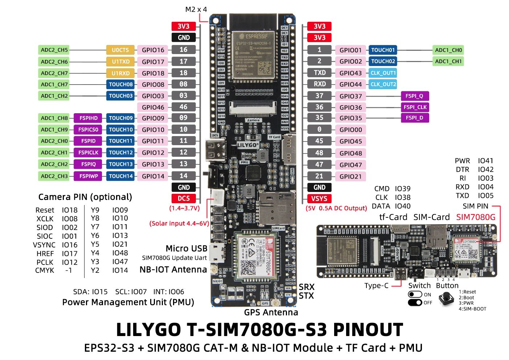

# VSTtflite-idf (ESP32-S3 YOLO Object Detection)

## Hardware Pinout

Full pinout description: [docs/T-SIM7080G-S3_Pinout.md](docs/T-SIM7080G-S3_Pinout.md)

## ESP-IDF Configuration

See: [docs/ESP_IDF_Configuration.md](docs/ESP_IDF_Configuration.md)

## Project Overview
# Project Overview

This project runs a **192×192 fully-integer-quantized YOLOv8-derived
model** on the ESP32-S3 T-SIM7080G-S3 using the Espressif TensorFlow
Lite Micro runtime.

The system performs:

-   SDMMC 1-bit SD card mounting\
-   Model loading from SD\
-   Tensor arena allocation in PSRAM (2 MB)\
-   Real JPEG decoding (esp_jpeg / TJpgDec)\
-   Nearest-neighbor 192×192 preprocessing\
-   INT8 quantization + dequantization\
-   Inference for *every* JPEG found recursively on the SD card\
-   Per-image classification output\
-   Saving the first preprocessed image (192×192 RGB PPM)

# Model Used

The active model is:

    /sdcard/models/yolov8n_2025-07-15_192_full_integer_quant.tflite

✔ Fully supported\
✔ Built-in ops only\
✔ Works on ESP32-S3\
✔ AllocateTensors OK

# Required SD Card Structure

    /sdcard/
    │
    ├─ models/
    │   └─ yolov8n_2025-07-15_192_full_integer_quant.tflite
    │
    └─ images/
        ├─ *.jpg
        ├─ *.jpeg
        ├─ subfolders/
        │   └─ recursive images

First preprocessed image saved as:

    original.jpg
    original_192x192.ppm

# Features

-   PSRAM (8 MB) detected\
-   SDMMC 1-bit mode\
-   JPEG decoding\
-   Model loading into PSRAM\
-   Preprocessing to 192×192\
-   INT8 inference\
-   Classification for *every* image

# Current Status

✔ PSRAM OK\
✔ SDMMC OK\
✔ JPEG decoding OK\
✔ Model loads correctly\
✔ Tensors allocated OK\
✔ Inference OK\
✔ Classification on all images

# Partition Table

    nvs,      data, nvs,     0x9000,   0x6000
    phy_init, data, phy,     0xf000,   0x1000
    factory,  app,  factory, 0x10000,  0xC00000
    storage,  data, 0x81,    0xC10000, 0x2F0000

# Repository Structure

    ├─ main/
    │   ├─ app_main.cpp
    ├─ docs/
    │   ├─ ESP_IDF_Configuration.md
    │   ├─ T-SIM7080G-S3_Pinout.md
    │   ├─ Lilygo_T-SIM7080G-S3_PINOUT.jpg
    ├─ partitions.csv
    └─ README.md
